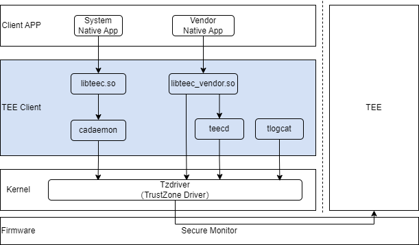

# TEE Client

## Introduction

TEE Client provides an API interface for accessing TEE to the OpenHarmony side CA (Client Application), and also includes TEE's proxy services to work with TEE to achieve secure storage, log printing, and other functions.

TEE Client includes the following modules:

- libteec.so: Provide the TEE Client API for native applications of HAP applications or system components.
- libteec_vendor.so: Provide TEE Client API for Native applications of chip components.
- cadaemon: Forward CA requests and authenticate the CA.
- teecd: As a proxy service for TEE, it supports TEE's implementation of secure storage and other functions. Simultaneously teecd supports identity recognition for CA.
- tlogcat: Support printing TEE logs.

Figure 1: Architecture diagram of TEE Client



## Directory

```
base/tee/tee_client
├── frameworks
│   └── libteec_vendor                 # libteec_vendor.so library, providing TEE Client API.
├── interfaces                         
│   ├── inner_api                      # Internal interfaces of this component
|   └── kits                           # The libteec.so library and corresponding TEE Client API published to SDK
└── services
    ├── authentication                 # CA identity recognition（Reserved function, not yet enabled）
    ├── cadaemon                       # Forward CA request
    ├── teecd                          # TEE proxy services
    └── tlogcat                        # TEE log service
```

## Interface Description

The list of APIs provided by the TEE Client to CA is as follows：

| Name                                                         | Description                 |
| ------------------------------------------------------------ | -------------------- |
| TEEC_InitializeContext (const char *name, TEEC_Context *context) | Initialize TEE context.    |
| TEEC_FinalizeContext (TEEC_Context *context)                 | End TEE context.      |
| TEEC_OpenSession (TEEC_Context *context, TEEC_Session *session, const TEEC_UUID *destination, uint32_t connectionMethod, const void *connectionData, TEEC_Operation *operation, uint32_t *returnOrigin) | Establish a conversation with TEE.    |
| TEEC_CloseSession (TEEC_Session *session)                    | Close the session with TEE.    |
| TEEC_InvokeCommand (TEEC_Session *session, uint32_t commandID, TEEC_Operation *operation, uint32_t *returnOrigin) | Send commands to TEE.      |
| TEEC_RegisterSharedMemory (TEEC_Context *context, TEEC_SharedMemory *sharedMem) | Register for shared memory.       |
| TEEC_AllocateSharedMemory (TEEC_Context *context, TEEC_SharedMemory *sharedMem) | Apply for shared memory.       |
| TEEC_ReleaseSharedMemory (TEEC_SharedMemory *sharedMem)      | Release shared memory.       |
| TEEC_RequestCancellation (TEEC_Operation *operation)         | Cancel the running operation. |

The above APIs are all specified by the GlobalPlatform TEE standard, which can be referred to in the "[TEE Client API Specification v1.0 (GPD_SPE_007)](https://globalplatform.org/specs-library/?filter-committee=tee)". There are differences between a small number of implementations and the GlobalPlatform TEE specification, and the differences are as follows:

1. The TEEC_Context structure member ta_path of the TEEC_OpenSession interface supports specifying the file path of TA (limited to the /data directory).

   Give an example：

   ```
   TEEC_Context context;
   context.ta_path = (uint8_t *)"/data/58dbb3b9-4a0c-42d2-a84d-7c7ab17539fc.sec"
   ```

   If CA doesn't use ta_path to specify the file path of TA, TEE Client will read the TA file named uuid.sec (uuid needs to be replaced with TA's real uuid) from the default path. There are two default paths: "/system/bin" and "/vendor/bin".

2. The input parameter connectionMethod of the TEEC_OpenSession interface only supports TEEC_LOGIN_IDENTIFY.

   For the fourth input parameter connectionMethod in the TEEC-OpenSession function, the GP specification defines six Login Methods, and TEE Client extends the type of TEEC_LOGIN_IDENTIFY and only supports this type of connectionMethod.

3. When calling TEEC_OpenSession, its parameters are limited.

   When calling the TEEC_OpenSession interface, the params[2] and params[3] in TEEC_Operation are reserved for the system and are not allowed for use by CA. CA can only use params[0] and [1].

## Guidelines for Compilation

The TEE Client component supports separate compilation and debugging. Taking the RK3568 chip as an example, run the following command to compile the TEE Client component：

```
./build.sh --product-name rk3568 --ccache --build-target tee_client
```

The path to the compiled product：out/rk3568/tee/tee_client

Compilation products can be pushed into the device for debugging：

```
hdc file send cadaemon.json /system/profile/
hdc file send cadaemon.cfg /system/etc/init/
hdc file send libteec.so /system/lib/
hdc file send libcadaemon.so /system/lib/
hdc file send tlogcat /system/bin/
hdc file send libteec_vendor.so /vendor/lib/
hdc file send teecd /vendor/bin/
```

## Related code repository

[tee_tzdriver](https://gitee.com/openharmony-sig/tee_tee_tzdriver)
