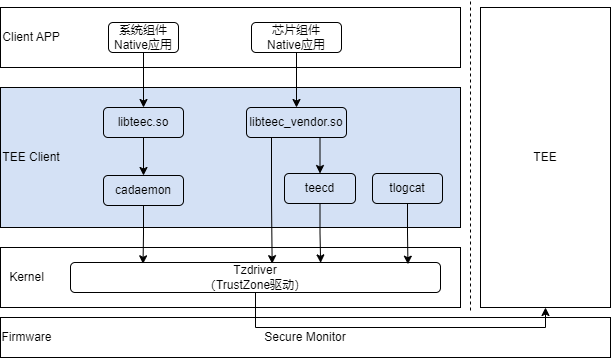

# TEE Client组件

## 简介

TEE Client组件向OpenHarmony侧CA（Client APP，即客户端应用）提供访问TEE的API接口，同时也包含TEE的代理服务，配合TEE实现安全存储、日志打印等功能。

TEE Client组件包含如下模块：

- libteec.so：为系统组件Native应用提供TEE Client API。
- libteec_vendor.so：为芯片组件Native应用提供TEE Client API。
- cadaemon：转发CA请求到Tzdriver驱动。
- teecd：作为TEE的代理服务，支持TEE实现安全存储等功能。
- tlogcat：支持打印TEE日志。

图1 TEE Client组件架构图



## 目录

```
base/tee/tee_client
├── frameworks
│   └── libteec_vendor                 # libteec_vendor.so库，提供TEE Client API
├── interfaces                         
│   ├── inner_api                      # 本组件内部接口
|   └── kits                           # 发布到SDK中的libteec.so库和对应的TEE Client API
└── services
    ├── authentication                 # CA身份识别（预留功能，暂未使能）
    ├── cadaemon                       # 转发CA请求
    ├── teecd                          # TEE代理服务
    └── tlogcat                        # TEE日志服务
```

## 接口说明

TEE Client组件对CA提供的API列表如下：

| 名称                                                         | 描述                 |
| ------------------------------------------------------------ | -------------------- |
| TEEC_InitializeContext (const char *name, TEEC_Context *context) | 初始化TEE上下文。    |
| TEEC_FinalizeContext (TEEC_Context *context)                 | 结束TEE上下文。      |
| TEEC_OpenSession (TEEC_Context *context, TEEC_Session *session, const TEEC_UUID *destination, uint32_t connectionMethod, const void *connectionData, TEEC_Operation *operation, uint32_t *returnOrigin) | 建立与TEE的会话。    |
| TEEC_CloseSession (TEEC_Session *session)                    | 关闭与TEE的会话。    |
| TEEC_InvokeCommand (TEEC_Session *session, uint32_t commandID, TEEC_Operation *operation, uint32_t *returnOrigin) | 向TEE发送命令。      |
| TEEC_RegisterSharedMemory (TEEC_Context *context, TEEC_SharedMemory *sharedMem) | 注册共享内存。       |
| TEEC_AllocateSharedMemory (TEEC_Context *context, TEEC_SharedMemory *sharedMem) | 申请共享内存。       |
| TEEC_ReleaseSharedMemory (TEEC_SharedMemory *sharedMem)      | 释放共享内存。       |
| TEEC_RequestCancellation (TEEC_Operation *operation)         | 取消正在运行的操作。 |

上述API均是GlobalPlatform TEE标准规定的，可参考《[TEE Client API Specification v1.0 (GPD_SPE_007)](https://globalplatform.org/specs-library/?filter-committee=tee)》。少量实现与GlobalPlatform TEE规范有差异，差异点如下：

1. TEEC_OpenSession接口的TEEC_Context结构体成员 ta_path支持指定TA的文件路径（限制在/data目录）。

   举例如下：

   ```
   TEEC_Context context;
   context.ta_path = (uint8_t *)"/data/58dbb3b9-4a0c-42d2-a84d-7c7ab17539fc.sec"
   ```

   如果CA不通过ta_path指定TA的文件路径，则TEE Client会从缺省路径下读取uuid.sec（uuid需要替换为TA的真实uuid）命名的TA文件。缺省路径有两个：/system/bin和/vendor/bin。

2. TEEC_OpenSession接口入参connectionMethod只支持TEEC_LOGIN_IDENTIFY。

   对于TEEC_OpenSession函数中第四个入参connectionMethod，GP规范定义了六种Login Method，TEE Client组件拓展了TEEC_LOGIN_IDENTIFY的类型，且只支持该种connectionMethod。

3. 调用TEEC_OpenSession时，TEEC_Operation参数有限制。

   在调用TEEC_OpenSession接口时，TEEC_Operation中params[2]和params[3]是预留给系统的，不允许CA使用，CA仅可以使用params[0]和params[1]。

## 编译指导

TEE Client组件支持单独编译调试，以RK3568芯片为例，运行以下命令编译TEE Client组件：

```
./build.sh --product-name rk3568 --ccache --build-target tee_client
```

编译产物路径：out/rk3568/tee/tee_client

可将编译产物自行推入设备中进行调试：

```
hdc file send cadaemon.json /system/profile/
hdc file send cadaemon.cfg /system/etc/init/
hdc file send libteec.so /system/lib/
hdc file send libcadaemon.so /system/lib/
hdc file send tlogcat /system/bin/
hdc file send libteec_vendor.so /vendor/lib/
hdc file send teecd /vendor/bin/
```

## 相关仓

[tee_tzdriver](https://gitee.com/openharmony-sig/tee_tee_tzdriver)
